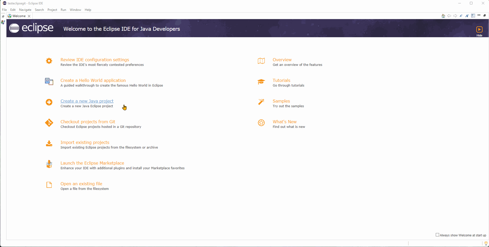
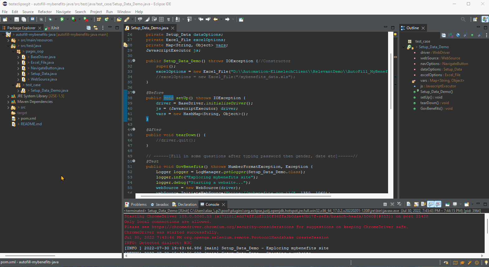
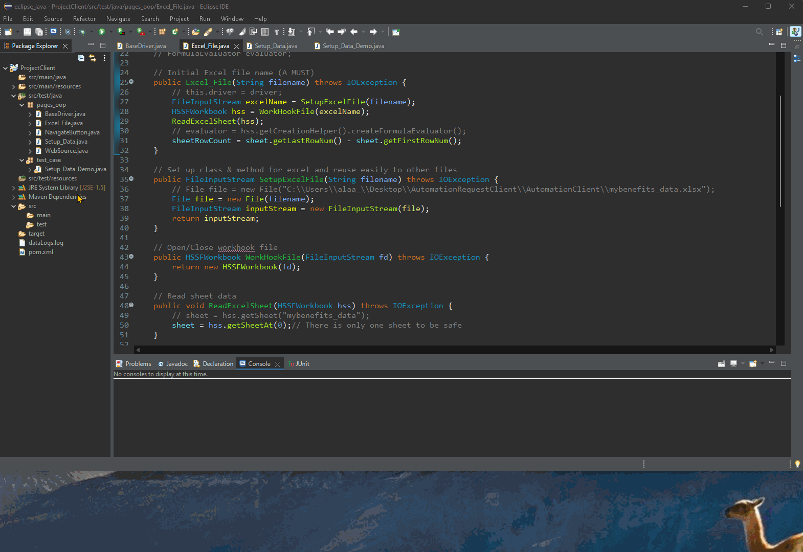
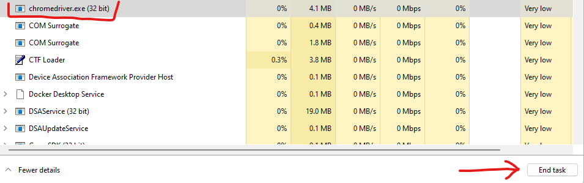

# Project Autofill mybenefits site in Java

Autofill data for mybenefits using selenium webdriver

### Live demo preview

## Prerequisites

* [Eclipse IDE](https://www.eclipse.org/downloads/)
* [Java](https://www.java.com/en/)
* Download Excel file "mybenefits_data.xls" from releases in GitHub - To read Java from Excel data.
* [Git Version-Control](https://git-scm.com/) - To use git CLI commands (Personally, I prefer to use this instead of EGit from Eclipse)

## Getting Started

1. Clone this repo

2. Run Eclipse and click the following `Package-->Import Project`(Or just click `Import existing projects` on welcome page), then `General-->Existing project into workspace`

3. Set as UTF-8 in Eclipse by going to `Preferences-->General-->Workspace` and select `UTF-8` as the Text File Encoding. This should set the encoding for all the resources in your workspace. Any components you create from now on using the default encoding should all match. 

4. on Package Explorer tab, right click `pom.xml` and click `Maven-->Update Project...` then click `OK` to update all packages(**errors will disappear from console**)

5. Download 2 required files from GitHub releases `mybenefits_data.xls` and `webdriver_setup.exe`, `Readme-setup.docx`(Optional for Hebrew readers) and place anywhere you want.

6. Run webdriver_setup.exe (Only works in Windows and it's safe) and wait for it to finish installation chromedriver in few moments

7. Open Eclipse project where you cloned "autofill-mybenefits-java" and redirect to `\testeclipsegit\autofill-mybenefits-java\src\test\java\pages_oop\BaseDriver.java` and change code in line 11: `System.setProperty("webdriver.chrome.driver","\old_path_to_your\\chromedriver.exe");` to your location of chromedriver like this `System.setProperty("webdriver.chrome.driver","\new_path_to_your\\chromedriver.exe");`

8. then redirect to `\autofill-mybenefits-java\src\test\java\test_case\Setup_Data_Demo.java`, then change code in line 33 to your saved location of excel file

9. Finally, redirect to `\autofill-mybenefits-java\src\test\java\test_case\` and right click `Setup_Data_Demo.java` then run and enjoy automating filling data that's reading from excel file(you can change data only in orange column

> NOTE: If for some reason Eclipse unable to run/debug `Setup_Data_Demo.java` or giving different errors, end all duplicates if found chromedriver.exe from Task Manager (Windows)

